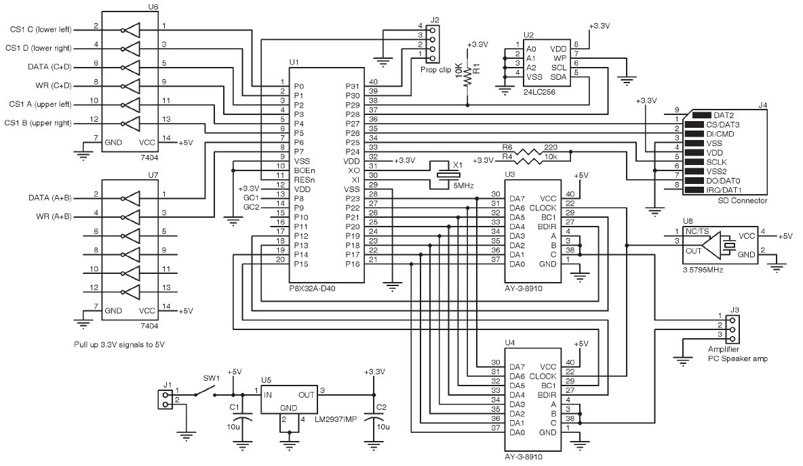
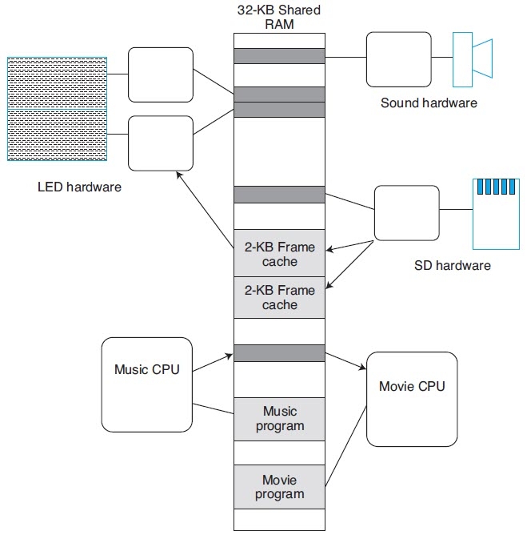

# The Twelve Days of Christmas Movie Project

## Published in Circuit Cellar, June 2010

## Youtube
https://www.youtube.com/watch?v=WiH14WjoCHw

The "buildscripts.bat" file assembles the two engine files. The output is "a.spin" and "b.spin" (text files) should be pasted
into the BOOT.SPIN file.

The "makemovie.bat" file combines the "day*.txt" files into "movie.bin". Reformat the SD card and place "movie.bin" on the card.

Edit individual movie sequences with the movie editor like this:

C:\project>java gx.movie.LEDGrid day8.txt

or

C:\project>java gx.movie.LEDGrid day8.txt day9.txt day7.txt

Each file will open in a separate tab on the display.
